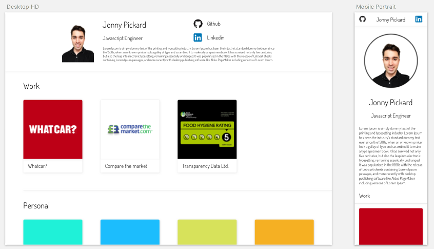
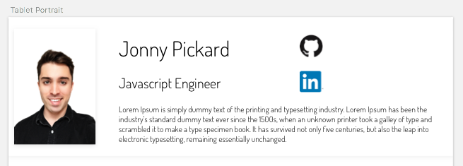
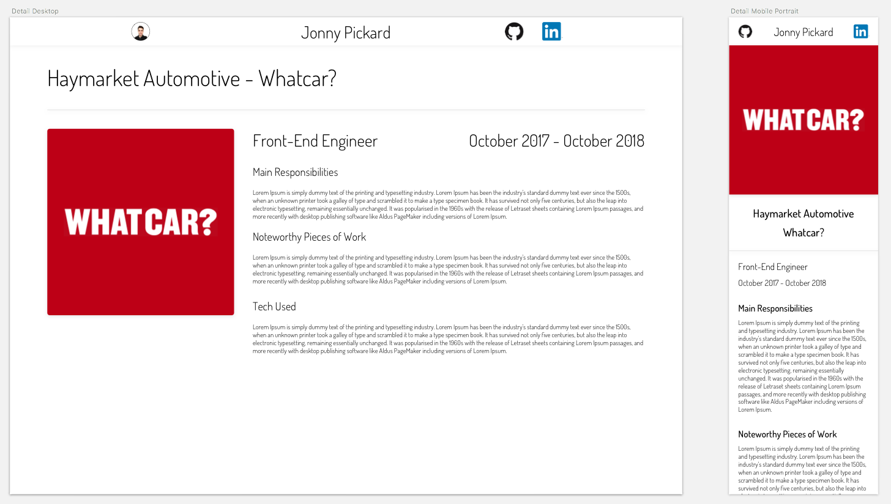
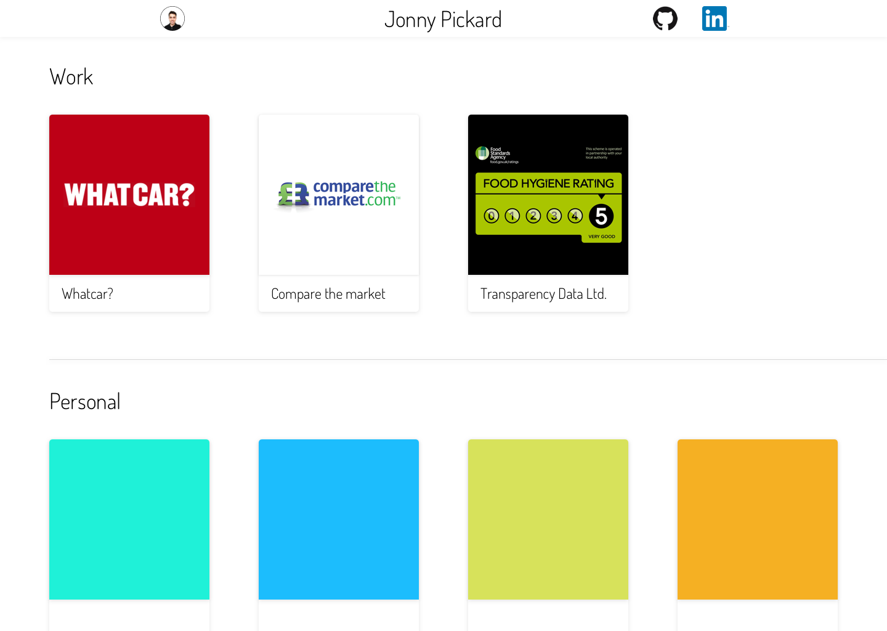
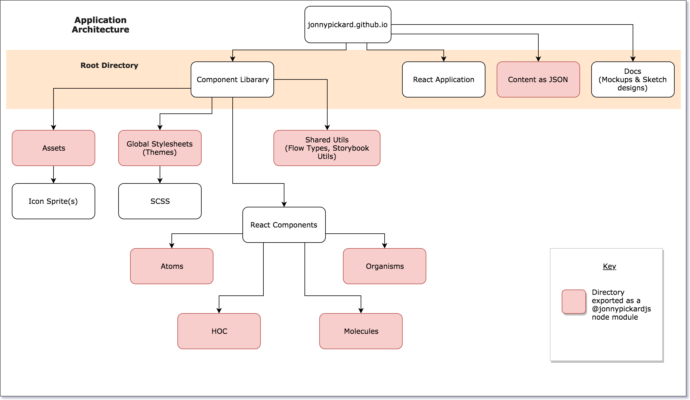

# JonnyPickard.github.io

Portfolio Website

> NOTE: I was testing out a variety of bundling + publishing options but having read the [Github Status](https://status.github.com/messages) page it turns out they are currently having issues with background processes including publishing new pages. I will therefore likely rollback a few current changes and work out an optimised publishing solution when the services are back up and running.

## Designs

### Homepage Desktop + Mobile

  

### Homepage Tablet Hero Variation

  

### Project Detail Pages

  

### Homepage Desktop Compact Nav Variation

  

## Wireframes

  

  

## App Architecture

  

The idea behind this app's architecture is high modularity. The components, key themes/ stylesheets, assets, content and all the shared utility functions are exported as node modules under the @jonnypickardjs scope. As each individual component uses its own specific versioned dependencies you can safely publish changes and updates at will without breaking any existing work.  

To make it manageable to develop in this fashion without having to publish/ pull every new change across all of the various locations I am using [yarn workspaces][1].

When the project releases **Alpha** stage of development I will start using [Lerna][2] to version and publish the components to the @jonnypickardjs NPM scope.

## Roadmap

### Required Components - *MVP

#### Component Library

##### Core

- [x] - Card (o)  
- [x] - Image (a)  
- [x] - ProfilePhoto (m)  
- [x] - HeroSection (o)  
- [x] - NavBar (o)  
- [x] - Icon Caption (o)  
- [x] - Heading (a)  
&nbsp;&nbsp;&nbsp;&nbsp;**types**:  
&nbsp;&nbsp;&nbsp;&nbsp;&nbsp;&nbsp; [h1 - h6]  
- [x] - Text (a)  
&nbsp;&nbsp;&nbsp;&nbsp;**types**:  
&nbsp;&nbsp;&nbsp;&nbsp;&nbsp;&nbsp; Body  
&nbsp;&nbsp;&nbsp;&nbsp;&nbsp;&nbsp; HeaderDescription  
- [x] - Divider (a)  
- [x] - Icon (a)  

**atom - (a)**  
**molecule - (m)**  
**organism - (o)**  

See [Atomic Design][0] by Brad Frost for more information.

##### HOC

- [x] - WithLink

#### Application Level

- [ ] - Templates  
  - [ ] - MainView  
  - [ ] - DetailView  

- [ ] - Pages  
  - [ ] - Main  
  - [ ] - ProjectDetail  

### Currently Working On

Top priority:
- Better bundle + deployment process - username.github.io websites can only be hosted from a master branch
  - Currently assets are not being linked to correctly. 
  - Therefor I will have to setup a few new branches. E.g. Develop & Release branches.
  - Master should be clean apart from the static assets + docs/ README
- Hero Section part 2 
  -  Setup App testing
  -  Sticky navbar/ solution for navbar on page change etc
  -  Viewport Size detection HOC

Lower priority
- Find a better way to visualize tech used + Experience/ Usage Per Job.
  - Table
  - Pie/ Donut chart?
- Find a better way to visualize main capabilities. 
  - Graphs? 

### Future Ideas

* Animations? 
* Sticky HOC
* Toggle buttons for interesting effects
* Custom Animations section
* D3? 

[0]: http://atomicdesign.bradfrost.com/
[1]: https://yarnpkg.com/lang/en/docs/workspaces/
[2]: https://lernajs.io/